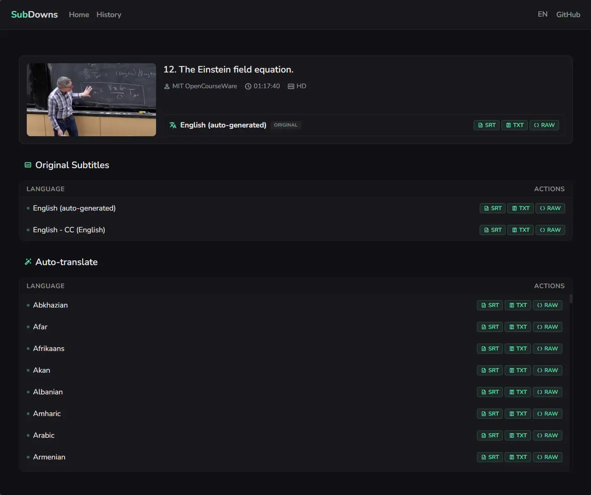

# SubDowns - YouTube Subtitle Downloader

A lightweight, modern web application and CLI tool that fetches and downloads YouTube subtitles. Built with a fast **Vue 3 + Vite** frontend and a robust **Node.js 24 + Hono** backend. 

It effortlessly processes YouTube URLs, extracts metadata, and allows you to download specific subtitle tracks in multiple formats (SRT, TXT, and RAW application/plaintext), as well as through MCP for AI Agents, prioritizing manually-uploaded subtitles over auto-generated captions.

## ✨ Features

- **Beautiful UI:** A highly responsive, modern interface with a custom design system, skeletons, and localized routing.
- **Multilingual Support (i18n):** Full support for English, Spanish, Russian, and Chinese out of the box.
- **Rich Metadata Extraction:** Fetches video titles, thumbnails, author details, and explicit language track availability directly from YouTube's internal APIs.
- **Format Flexibility:** Download subtitles as strictly formatted `.srt`, clean `.txt`, or the raw YouTube `.json`.
- **Local History:** Fully tracks your downloaded history securely in your browser using the native Cache API.
- **TypeScript Native:** End-to-end type safety across both the Vue client and Hono server.
- **OpenAPI Standard:** Easy to work with, well-documented OpenAPI backend at `/api/docs`.
- **Native MCP Server:** Connect SubDowns MCP server to LLM Harness of your Choice - Claude Code, Codex, Antigravity, OpenCode, Windsurf, Cursor, etc.




## 🚀 Quick Start (Web App)

Ensure you have [Node.js v24+](https://nodejs.org/) installed on your machine.

1. Clone or download this repository.
2. Install the dependencies:
   ```bash
   npm install
   ```
3. Start the development server (runs both the Vite frontend and Hono backend concurrently):
   ```bash
   npm run dev
   ```
4. Open your browser and navigate to the provided local URL (typically `http://localhost:5173`).

### Alternative Start (Docker)

You can run the application container using Docker Compose or native Docker commands:

#### Option A: Docker Compose (Recommended)
1. Start the container in detached mode:
   ```bash
   docker compose up -d
   ```
2. Stop the container:
   ```bash
   docker compose down
   ```

#### Option B: Manual Docker Commands
1. Build the image:
   ```bash
   docker build -t subdowns-app .
   ```
2. Run the container:
   ```bash
   docker run -d -p 3069:3069 --name subdowns subdowns-app
   ```


## 🤖 MCP Integration (For AI Agents)

SubDowns features a native **Model Context Protocol (MCP)** server, allowing AI agents (like Claude Desktop, Cursor, or Windsurf) to fetch YouTube subtitles natively as a built-in tool!

To hook your agent into SubDowns, simply add this to your agent's MCP configuration:

```json
{
  "mcpServers": {
    "subdowns-subtitles-mcp": {
      "url": "http://<ipconfig-ipv4-ip>:3069/api/mcp/sse"
    }
  }
}
```

This exposes the `get_youtube_subtitles` tool, requiring only a `vid_id`.


## 💻 Optional CLI Workflow (For Batch Processing)

If you prefer to run batch downloads via the terminal, you can still use the underlying CLI processor.

1. Create a JSON file (e.g., `links.json`) in the root directory containing an array of YouTube URLs:
   ```json
   [
       "https://youtu.be/OIjLUzS6SQA"
   ]
   ```

2. Run the script:
   ```bash
   npm start
   ```

### Custom Input Files and Meta Directory

If you want to use a different file for your links, you can pass it directly as an argument. You can also specify a custom directory for your `.meta` files using the `--meta-dir=` flag (perfect for storing metadata on another disk or separate folder):

```bash
npm start custom-links.json --meta-dir=C:/MyMetaFiles
```

### CLI Outputs

For each processed video in CLI mode, the tool creates a `subtitles/` folder and generates two files:
- `[VIDEO_ID] - Video Title - [Language].txt` — The raw downloaded subtitles text.
- `[VIDEO_ID] - Video Title - [Language].meta` — A lightweight JSON metadata file containing video, author, and source file tracking details.


---

### Shoutouts to

* Vue3 - lightweight, nice to work with UI framework
* NaiveUI - color schema
* Hono - awesome backend library
* Zod - industry standard validation
* OpenAPI - industry standard api
* Docker - do I need to comment on it?
* And others - Vite, esbuild, vitest, scalar, lru-cache, mcp, pinia, VueUse